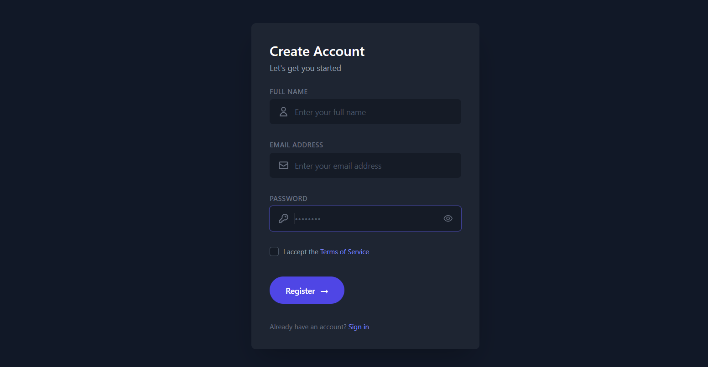
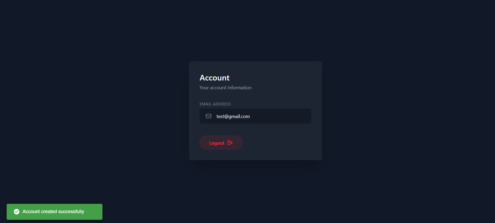

# 🚀 spring-auth-system

## 🧩 start the project

clone the repo

```bash
git clone https://github.com/RaoufGhezal/spring-auth-system
cd spring-auth-system
```

## 🐘 create postgresql container

```bash
docker run --name spring-auth-db -e POSTGRES_DB=spring_auth_db -e POSTGRES_USER=postgres -e POSTGRES_PASSWORD=postgres -p 5432:5432 -d postgres
```

## 🔐 create local secrets file

create this file:

```bash
/server/src/main/resources/application-local.properties
```

add your environment variables:

```properties
DB_URL=jdbc:postgresql://localhost:5432/spring_auth_db
DB_USERNAME=postgres
DB_PASSWORD=postgres

JWT_SECRET=your-secret-key
```

## ⚙️ enable local profile

make sure your application uses the local profile:

```properties
spring.profiles.active=local
```

(you can place this in `application.properties`)

## 🌐 frontend config

open client api file:

```bash
/client/src/services/api.ts
```

set backend endpoint:

```ts
const baseURL = "http://localhost:8080"
```

## ▶️ start client

```bash
cd client
npm install
npm run dev
```

## ▶️ start server

```bash
cd server
./mvnw spring-boot:run
```

---
